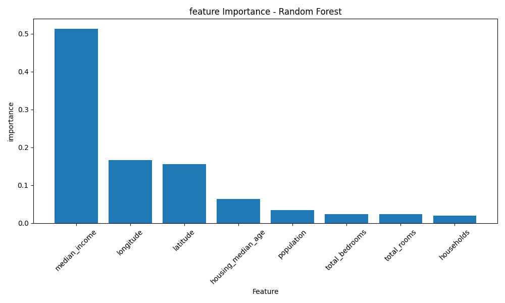
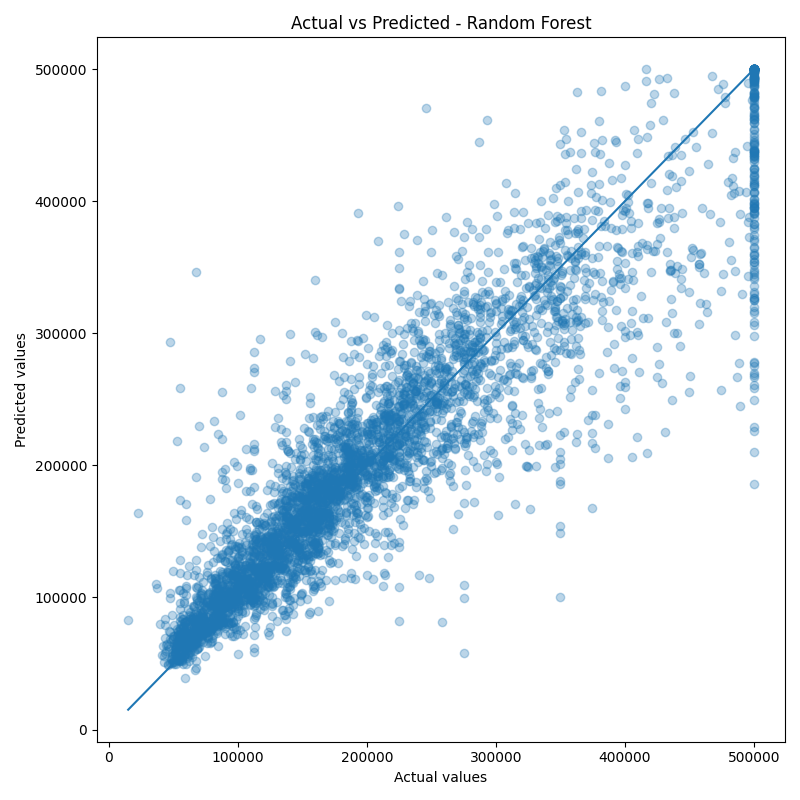

## Wnioski
Random Forest Regressor osiągnął lepsze wyniki niż Linear Regression.

- Linear Regression: R2 = 0.6401, RMSE = 70156.12
- Random Forest Regressor: R2 = 0.8239, RMSE = 49075.70

Oznacza to, że Random Forest lepiej wyjaśnia zmienność cen domów i popełnia mniejszy średni błąd predykcji.

## Feature importance
Najważniejszą cechą dla modelu Random Forest okazało się `median_income`, co sugeruje, że poziom dochodu w danym obszarze silnie wiąże się z ceną domu.

Duże znaczenie miały także `longitude` i `latitude`, czyli lokalizacja geograficzna. Pozostałe cechy, takie jak liczba pokoi, liczba sypialni, populacja czy wiek budynku, miały mniejszy wpływ na predykcję.

## Feature Importance Plot

## Actual vs Predicted Plot

